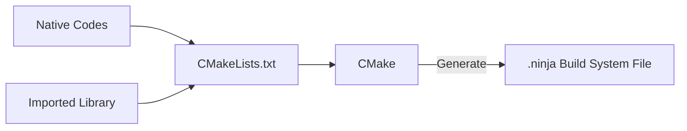
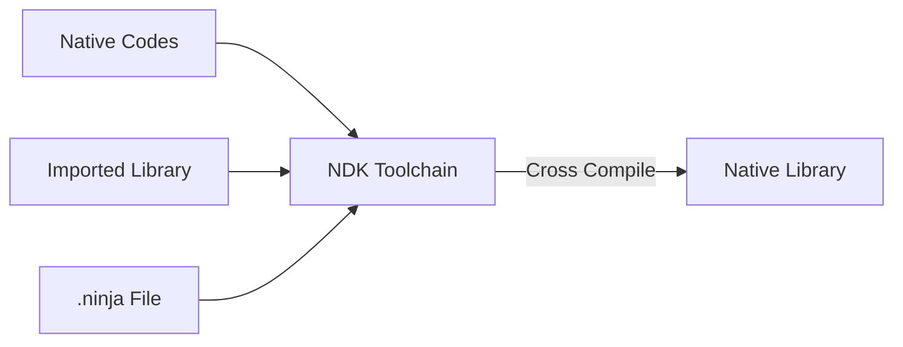
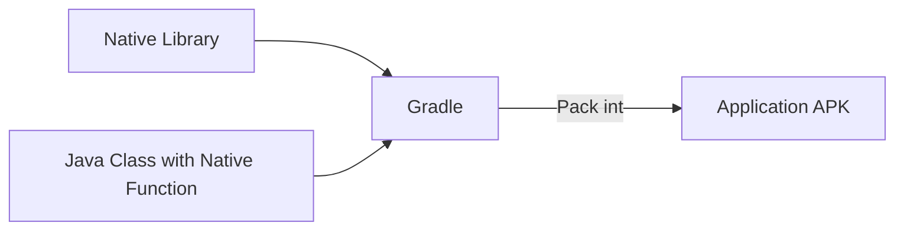

## 前言与环境说明

随着 FFmpeg、NDK 与 Android Studio 的不断迭代，本文可能也会像我参考过的过期文章一样失效（很遗憾），但希望本文中提到的问题排查以及步骤说明能够帮到你，如果发现了文章中的谬误以及不足之处也欢迎你提供建议与指正，十分感谢🙏。

初步目标是使用 FFmpeg 实现 Android 内简单的视频剪辑、添加背景音乐、添加字幕等功能，由于本人初学 Android 开发，能力有限，基础薄弱，无法较为全面地深入学习过程中遇到的问题，文章中可能掺杂有一些**知其然而不知其所以然**的部分或一些不恰当不精确的个人理解，还请见谅🙇。


设备：macOS Big Sur 11.6 (Apple Silicon M1)

FFmpeg 版本：`4.4`

开发环境：

- Android Studio Arctic Fox | 2020.3.1 Patch 3 arm64 preview
- JavaVersion = `1.8`
- minSdk : `21`
- NDK Version : `23.1.7779620`
  - 目前 NDK 在苹果芯片下仍只能使用 Rosetta 2 转译后进行使用
- CMake Version : `3.22.0-rc2`
  - 目前从 Android Studio 内 SDK Manager 中所能取得的最新版为 `3.18.1`
  - CMake 已在 `3.19.3` 版本后提供**对苹果芯片的支持**
- Gradle Version：`7.0.3`


## 前置知识准备

在实际上手前，阅读了 Android 与 Java 的官方开发文档与几篇优秀的相关文章，按照自己的理解和知识水平，整理了一些概念的**基本且浅显**的解释，方便理解下一步要进行的操作。


1. Native 层

2. JNI

3. NDK

4. 交叉编译、建构系统与 CMake

4. ABI 与动态链接库

5. FFmpeg

   

### Android 系统的 Native 层


虽然 Android 系统的许多 API 使用 Java 开发，但许多核心 Android 系统组件和服务（如 ART 和 HAL 等）由 C/C++ 写成，需要以 C/C++ 编写的 Native 库。因此 Android 除了提供开发 Java 代码所需的 JDK (Java Development Kit) 之外，还提供了供开发者进行 Native 层开发的 NDK (Native Development Kit)。


Java 运行于 Java 虚拟机之上，因而实现了易移植、可跨平台运行等特性，但这也使得 Android 需要依赖一些「Native」的代码来访问系统底层，去完成一些 Java 实现不了的任务。也正因如此，C/C++ 这类「原生」的语言也使 Android 程序丧失了跨平台这一特性，在为 Android 编译 C/C++ 程序时需考虑目标机器所使用的 CPU 架构、操作系统版本等。


### JNI

JNI 即 Java Native Interface，是 Java 提供用来与其他语言编写的程序通信的接口，之中定义了 Java 字节码与 Native 代码的交互方式。这里我们通过 NDK 来使用 JNI，从而实现 Android 程序中 Java 代码与 C/C++ 代码的相互调用。


这里记录一些遇到的问题和自己认为可以暂时过掉的一些 quick answer：

- [x] 动态链接库 (.so) 与静态库 (.a) 的区别
  - 静态库中的代码在编译后直接进入可执行文件中，而动态链接库则是将代码包含在程序外的库文件中，在运行时被程序所调用，不能单独执行
- [x] 什么是工具链 (Toolchain) ?
  - NDK 中提供的用于交叉编译 C/C++ 代码的一系列工具
- [x] Cmake 在这里到底用来干什么？
  - CMake 根据 CMakeLists.txt 配置文件来生成一个指导工具链进行编译的标准建构文件，随后工具链便可根据建构文件将源代码编译成动态链接库
  - 当我们编译一个 .c 文件的时候，我们可以直接将其丢进 gcc 中编译；但当我们需要编译一个项目的一系列 .c 文件时，一股脑丢进去编译显然就会大乱套了，于是我们需要一个建构系统来管理这个项目的编译。在 Windows 下我们使用 Visual Studio 的 .sln 文件，macOS 下我们使用 Xcode 的 .xcodeproj 文件，Linux 下我们可以使用 Make 的 Makefile 文件。这些建构系统的建构文件可以指导编译器或编译工具链来编译 .c 文件。
- [x] What about Ninja ?
  - Ninja 是一个专注于编译速度的建构系统，用了大家都说好


### NDK

NDK 即 Native Development Kit，在这里可以让我们在 Android 开发中使用 C/C++ 语言编写而成的库。

在 Android 开发中，我们应当先在 Java 文件中编写 Native 方法，然后在 C/C++ 文件中实现 Native 方法，接着使用 NDK 的工具链将 C/C++ 代码编译成**动态链接库**，然后使用 Android Studio 的 Gradle 将我们编译好的库打包到 APK 中。随后在运行程序时，Java 代码就可以通过 Java 原生接口 (JNI) 框架调用库中的 Native 方法。


### 交叉编译、建构系统与 CMake

交叉编译 (Cross Compile)，指在与目标机器不同处理器架构的编译机器上，编译出适合目标机器架构运行的程序，我们如果要在 x86_64 平台的 PC 中编译出运行于 arm 架构的 Android 设备中的 C/C++ 程序，就需要用到交叉编译工具链 (Toolchain)，即用于交叉编译的一系列工具。这里我们使用 NDK 提供的默认工具链（从 r19 版本之后开始，NDK 不再支持独立工具链）。

当我们编译一个 .c 文件的时候，我们可以直接将其丢进 gcc 中编译；但当我们需要编译一个项目的一系列 .c 文件或整合已有的库时，一股脑丢进去编译显然就会大乱套了，于是我们需要一个**建构系统**来管理这个项目的编译。例如在 Windows 下有 Visual Studio 的 .sln 文件，macOS 下有 Xcode 的 .xcodeproj 文件，Unix 下可以使用 Make 的 Makefile 文件或 Ninja 的 .ninja 文件等等。

这些建构系统的建构文件可以指导编译器或编译工具链来编译整个项目。像 Makefile 或者 .ninja 这样的较为简单的建构系统文件，我们可以尝试手写一份进行建构，但当我们的建构以及编译要涉及跨平台交叉编译时，我们便要针对不同的目标平台编写不同的文件，因此目前更通用的做法是使用像 CMake 这样更高等级的建构系统来生成这些建构文件。

CMake 是 Cross platform Make 的简写。CMake 是一个开源的跨平台编译工具（又被称为「**元建构系统**」），其可以根据 CMakeLists.txt 配置文件来生成一个指导工具链进行编译的标准建构文件（不同平台下可选择生成不同建构系统的建构文件），随后工具链便可根据该建构文件将源代码编译成动态链接库。

Android Studio 推荐使用 CMake + Ninja + NDK 内置工具链来进行 Native 库开发。


### ABI

ABI 即应用二进制接口 (Application Binary Interface)。ABI 中包含以下信息

- 可使用的 CPU 指令集（和扩展指令集）。

- 运行时内存存储和加载的字节顺序。Android 始终是 little-endian（小端法）。

- 在应用和系统之间传递数据的规范（包括对齐限制），以及系统调用函数时如何使用堆栈和寄存器。

- 可执行二进制文件（例如程序和共享库）的格式，以及它们支持的内容类型。

- 如何重整 C++ 名称。

  

当我们编写 Java 代码时，由于 Java 运行在 Java 虚拟机上，我们无需关心设备具体的硬件条件、架构或 CPU，但当我们需要在 Android 程序中使用 Native 代码时，由于不同的 Android 设备使用不同的 CPU，而不同的 CPU 支持不同的指令集，CPU 与指令集的每种组合都有专属的 ABI。因此我们需要针对不同的 Android ABI，构建并编译出**适应于不同 ABI** 的 .so 动态链接库。

当我们将这些为不同 ABI 所编译的库打包成 APK 时，这些 APK 自然也是只有特定 ABI 的 Android 设备才能安装使用的。例如：苹果芯片支持的 arm64-v8a 镜像无法安装专门为 armeabi-v7a 编译的 APK 包，我们在编译的时候可以在 Gradle 的 `ndk.abiFilters` 参数中控制要编译打包何种 ABI 的库。


### FFmpeg

FFmpeg 是一套 C 语言下开发的开源、跨平台的音视频录制、转码及流处理的完整解决方案，被不少开源项目所使用。


经过前述文字的梳理，想必已经对 Android 下使用 Native 库的的基本逻辑与行为有了一定的理解，我们再通过几张流程图来进行梳理：

1. 编写 CMakeLists.txt ，将 C/C++ 代码与引入的 FFmpeg 库加入到项目中，并链接到一起。
2. 在 Java 类中编写并调用 Native 方法
3. 在 C/C++ 代码中实现 Native 方法，Native 方法调用 FFmpeg 库
4. 使用 CMake + Ninja 与 NDK 工具链将 C/C++ 代码以及引入的 FFmpeg 库编译成动态链接库
5. Gradle 将动态链接库打包进 APK 中








## 编译 FFmpeg 

先下载一份 [FFmpeg 源码](https://ffmpeg.org/download.html) 进行编译，你可以选择别人编译好的 FFmpeg build 或者使用别人写好的编译脚本，省去不少麻烦的同时跳过这一步，这里推荐 [FFmpegKit](https://github.com/tanersener/ffmpeg-kit/)。


Android 工程中只支持导入 .so 结尾的动态库，形如：`libavcodec-57.so` 。但是 FFmpeg 编译生成的动态库默认格式为 xx.so.版本号 ，形如：`libavcodec.so.57` ， 所以需要修改 FFmpeg 根目录下的 configure 文件，使其生成以 .so 结尾格式的动态库：

```shell
# 将 configure 文件中 build settings 下的：
SLIBNAME_WITH_MAJOR='$(SLIBNAME).$(LIBMAJOR)' 
LIB_INSTALL_EXTRA_CMD='$$(RANLIB) "$(LIBDIR)/$(LIBNAME)"' 
SLIB_INSTALL_NAME='$(SLIBNAME_WITH_VERSION)' 
SLIB_INSTALL_LINKS='$(SLIBNAME_WITH_MAJOR) $(SLIBNAME)'

#替换为：
SLIBNAME_WITH_MAJOR='$(SLIBPREF)$(FULLNAME)-$(LIBMAJOR)$(SLIBSUF)'
LIB_INSTALL_EXTRA_CMD='$$(RANLIB)"$(LIBDIR)/$(LIBNAME)"'
SLIB_INSTALL_NAME='$(SLIBNAME_WITH_MAJOR)'
SLIB_INSTALL_LINKS='$(SLIBNAME)'
```


FFmpeg 已经为我们准备好了 Makefile 可以直接用于建构，还为我们提供了 configure 程序可以调节编译的设置，configure 提供许多参数可供选择，如编译模块，目标平台、编译工具链等等，通常的做法是编写一份脚本进行设置与建构，我们在目录下新建一个 build.sh 脚本文件。

在编译的过程中，由于自己技术水平过低，照抄别人的攻略脚本的过程中走了不少弯路。

这里是本人用于在 macOS 下编译 arm64-v8a 的 FFmpeg 使用的脚本。请务必根据说明与自己的工具链情况进行修改。如果在编译过程中遇到问题，一定要先**查 log** 以及翻阅**官方文档**，此处参照的 [文档](https://developer.android.google.cn/ndk/guides/other_build_systems?hl=zh-cn#autoconf)。


```shell
NDK_ROOT=						#NDK根目录
TOOLCHAIN=$NDK_ROOT/toolchains/llvm/prebuilt/darwin-x86_64
#工具链目录 目前NDK在M1还只能在Rosseta转译下使用x64的工具链

export PATH=$PATH:$TOOLCHAIN/bin
target_arch=aarch64
target_host=aarch64-linux 								#编译目标平台
toolchain_prefix=$target_host-android21		#在 configure 中定义了新变量

#target_arch=arm
#target_host=armv7a-linux							
#toolchain_prefix=$target_host-androideabi21
#这里是编译armv7的选项

#这里的变量设置以及接下来对 configure 的编辑非常重要
#如果照抄之前的过期博文(或此文)设置脚本会导致编译失败
#详见下面的分析

PREFIX= #编译输出路径
ANDROID_API=21 #最小API

./configure \
    --prefix=$PREFIX \								#设定输出路径
    --enable-postproc \
    --enable-jni \
    --enable-shared \									#生成动态链接库
    --disable-static \ 								#不生成静态库
    --enable-cross-compile \ 					#启用交叉编译
    --extra-cflags="-D__ANDROID__API__=21 -U_FILE_OFFSET_BITS" \
    --cross-prefix=$target_host- \ 		#设定交叉编译目标前缀
    --cross_prefix_clang=$toolchain_prefix- \
    --arch=$target_arch \							#设定目标框架
    --target-os=android	\							#设定目标平台系统 iOS是darwin
    --sysroot=$TOOLCHAIN/sysroot 			#设定sysroot目录

    

make clean
make -j4
make install

```


说明：

在编写脚本前，请先 `cd` 到工具链 `bin` 目录下，`ls` 查看工具链程序的文件名格式，在本人使用的 NDK 23.1.7779620 darwin 工具链中情况如下：

```shell
……

aarch64-linux-android-as           
aarch64-linux-android21-clang      
aarch64-linux-android21-clang++    
aarch64-linux-android22-clang      
aarch64-linux-android22-clang++    
aarch64-linux-android23-clang      
aarch64-linux-android23-clang++    
aarch64-linux-android24-clang      
aarch64-linux-android24-clang++    
aarch64-linux-android26-clang      
aarch64-linux-android26-clang++    
aarch64-linux-android27-clang      
aarch64-linux-android27-clang++    
aarch64-linux-android28-clang   

………

llvm-ar
llvm-as
llvm-cfi-verify
llvm-config
llvm-cov
llvm-cxxfilt
llvm-dis
llvm-dwarfdump
llvm-dwp
llvm-lib
llvm-link
llvm-lipo
llvm-modextract
llvm-nm

……
```

可以看到，NDK 提供的 clang 都是带有 Android 版本号前缀的，此时打开 configure 文件的源码，搜索到 `if test "$target_os" = android` 这一行，查看 Android 编译设置，可以发现许多问题：

1. 这里的文件名全部设置成以我们输入的 `cross_prefix` 为前缀，但经过我们的查看，我们的文件名前缀实际上是形如 `aarch64-linux-android21` 这样 `${cross_prefix}-android+版本号` 的格式。

2. 这里将 `cc_default` 重写为了 clang，但没有重写 `cxx_default`。

3. 这里的 `strip` 、`ar`、`pkg-config` 与 `nm` 工具也设置成了以 `cross_prefix` 为前缀，但实际上，可以看到我们的几个文件名前缀实际上是 `llvm-` ，在 Android 官方文档中也可以得知 binutils 工具（例如 `ar` 和 `strip`）不需要前缀，因为它们不受 `minSdkVersion` 影响。而 `pkg-config` 并没有内置在工具链中，需要我们通过包管理器手动获取。(本人没有安装的情况下编译也没有失败)

   ````
   brew install pkg-config
   ````

   
   
   **请务必注意，这里的实际设置情况请以你自己的 NDK 工具链为参照。**
   
   

为了保证正确编译，configure 的相关代码修改如下：

```shell
set_default target_os
if test "$target_os" = android; then
    cc_default="clang" 
    cxx_default="clang++" 												
fi											
#将cxx_default重写 
#注：ndk r17版本后已弃用gcc

ar_default="llvm-${ar_default}"										
#将前缀修改为llvm-
cc_default="${cross_prefix_clang}${cc_default}"		
#在CMDLINE_SET中定义一个新变量cross_prefix_clang并在脚本中输入
cxx_default="${cross_prefix_clang}${cxx_default}"	
#也可以直接修改成${cross_prefix}-android21-${cxx_default}
nm_default="llvm-${nm_default}"
pkg_config_default="${pkg_config_default}"				
#使用我们安装的pkg-config
ranlib_default="llvm-${ranlib_default} -D"
strip_default="llvm-${strip_default}"
windres_default="${cross_prefix}${windres_default}"
```

运行脚本，如果编译成功可以看到我们设置的输出目录下已经出现了`include`、`bin`、`share`和 `lib` 这几个文件夹，`lib` 文件夹内就是我们需要的编译好的 FFmpeg 动态链接库。


## 将 FFmpeg 集成在 Android 中

得到了 FFmpeg 的动态链接库之后，我们还不能直接在 Android 应用中使用。因为我们还没有实现 Java 代码与 C 代码的互相通信：JNI。不少教程使用的是 NDK 提供的 ndk-build，但 Android 官方现在更加推荐使用 CMake，我们可以在 Gradle 插件的帮助下直接调用 CMake 而免去命令行操作之劳，请先检查是否安装 Ninja。

可以简单地按以下步骤操作：


1. 新建一个项目，在 `app` 目录下右键，选择 `Add C++ to Module` ，Android Studio 会在 `main` 目录下自动生成 `ProjectName.cpp` 与 `CMakeLists.txt`，打开 `CMakeLists.txt` 观察格式，生成的注释已经很好读了，这里不再赘述。

   ```cmake
   ……
   add_library(
           ffmpegtest				#库名
           SHARED	
           ffmpegtest.cpp)		#实现JNI方法的cpp代码 自动生成文件名为项目名
   ……
   ```

2. 在 `cpp` 目录下新建 `lib/arm64-v8a` 文件夹，将我们上一步骤编译好的 FFmpeg 的 `lib` 目录下 .so 格式的动态链接库粘贴进去，并将 `include` 文件夹复制粘贴到 `cpp` 目录下。（如果编译了其他 ABI 的库，在 `lib` 目录下新建以 ABI 为名的子目录存放）

3. 打开 `CMakeLists.txt` 进行编辑，添加以下内容：

   ```cmake
   add_library(avcodec 							
   				#库名 注意无lib前缀
           SHARED										
           #SHARED	表示动态链接库
           IMPORTED)									
           #IMPORTED 表示外部导入库
           
   set_target_properties(avcodec			
   #设置avcodec库的导入路径
           PROPERTIES IMPORTED_LOCATION
           ${CMAKE_SOURCE_DIR}/lib/${CMAKE_ANDROID_ARCH_ABI}/libavcodec.so)
           													#CMAKE_SOURCE_DIR是CMakeLists.txt所在目录 请勿省略
           													#CMAKE_ANDROID_ARCH_ABI是在gradle中的abifilter参数 
           													#此处是arm64-v8a	请勿省略
           													
   ……																#如上格式添加所有FFmpeg动态链接库
   
   include_directories(${CMAKE_SOURCE_DIR}/include)
   																	#添加FFmpeg头文件
   																	
   target_link_libraries(
           ffmpegtest
           
           avfilter									
          	#将所有动态链接库与ffmpegtest库（实现了JNI）链接
           avformat									
           #至此 可以在java代码内通过JNI调用FFmpeg库中函数
           avdevice									
           #同时在ffmpegtest.cpp中的JNI函数中调用Java中的方法 
           avcodec										
           #从而在Android中实现与FFmpeg库的交互
           avutil
           swresample
           swscale
           postproc
           ${log-lib})
   ```

4. 在类或应用中初始化库，在类中编写一个没有函数体的 native 方法并调用，这个时候方法会报错，⌥(Alt) + Enter 让 Android Studio 帮我们在 `ffmpegtest.cpp ` 内生成 JNI 函数。

   ```java
   private native void run();
   static{
       System.loadLibrary("ffmpegtest");
   }
   
   ……
   ```

   ```cpp
   #include <jni.h>
   #include <android/log.h>								//导入Android log头文件
   extern "C"{															//FFmpeg由C写成 注意使用C关键字括起来
   #include "libavcodec/avcodec.h"					//导入FFmpeg头文件
   JNIEXPORT void JNICALL
   Java_com_example_ffmpegtest_MainActivity_run(JNIEnv *env, jobject thiz) {
       __android_log_print(ANDROID_LOG_INFO,"FFmpegTag",
                           "avcodec_configuration():\n%s",avcodec_configuration()); 
     																			//输出avcodec配置到logcat
   }
   }
   ```

5. 打开 module 等级的 `build.gradle`

   - 检查 `ndkVersion` 与 `cmake.version` 
   - 在 `defaultConfig.externalNativeBuild` 中添加 `ndk{abiFilters "arm64-v8a"}` ，**如果不指定这个参数，Gradle 会建构所有 ABI 的应用**，如果你还编译了其他 ABI 的 FFmpeg 并且想要为其他 ABI 构建应用，在这里添加。
   - **不要**添加 `sourceSets.main.jniLibs.srcDirs`，这个参数已经过时而且会导致建构失败

6. build 并运行，可以在 logcat 中看到 cpp 代码中从 FFmpeg 函数中发出的信息。至此，我们初步实现了编译并在 Android 中集成了 FFmpeg。

   
   
   问题排查：
   
   - 绝大部分的问题由 CMakeLists.txt 没有正确编写引发，请先检查 CMake 的错误报告以及建构日记，确认 CMakeLists.txt 下库的**头文件添加路径**、**动态库添加路径**与**链接库名**有无错误。
   - 检查 CMake 与 NDK 的**版本**是否显式地在 `build.gradle` 中定义，是否正确配置了 CMake 和 Ninja
   - 检查是否配置了 `abiFilters`


## References

[在 Android 上利用 FFmpeg 给 Gif 图片加字幕](https://uniquestudio.feishu.cn/wiki/wikcnaZykdmOaQTR8F27iEENBcg)

[【联创の炼金工坊】Android NDK 之 Hello World](https://mp.weixin.qq.com/s/C23jWjwmgydqqBNdgMc-DQ)

[GCC/Make/CMake 之 GCC - 知乎](https://zhuanlan.zhihu.com/p/342151242)

[Android 集成 FFmpeg (一) 基础知识及简单调用_yhao的博客-CSDN博客](https://blog.csdn.net/yhaolpz/article/details/76408829)

[将 NDK 与其他构建系统配合使用  |  Android NDK  |  Android Developers](https://developer.android.google.cn/ndk/guides/other_build_systems?hl=zh-cn)

[Android ABI  |  Android NDK  |  Android Developers](https://developer.android.com/ndk/guides/abis)

[自动打包 CMake 使用的预构建依赖项  |  Android 开发者  |  Android Developers](https://developer.android.com/studio/releases/gradle-plugin#cmake-imported-targets)

