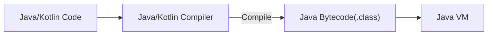
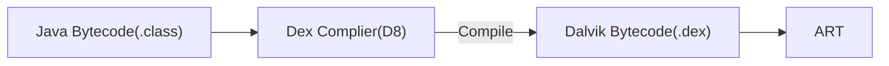
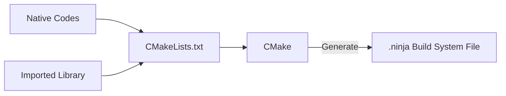
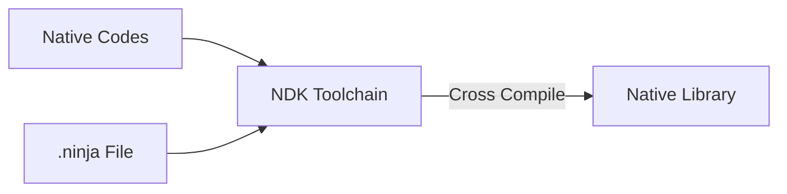
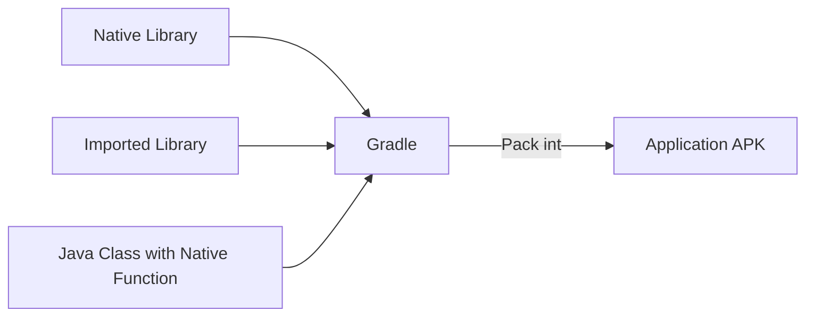
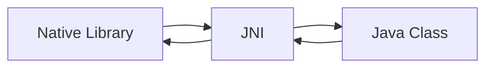
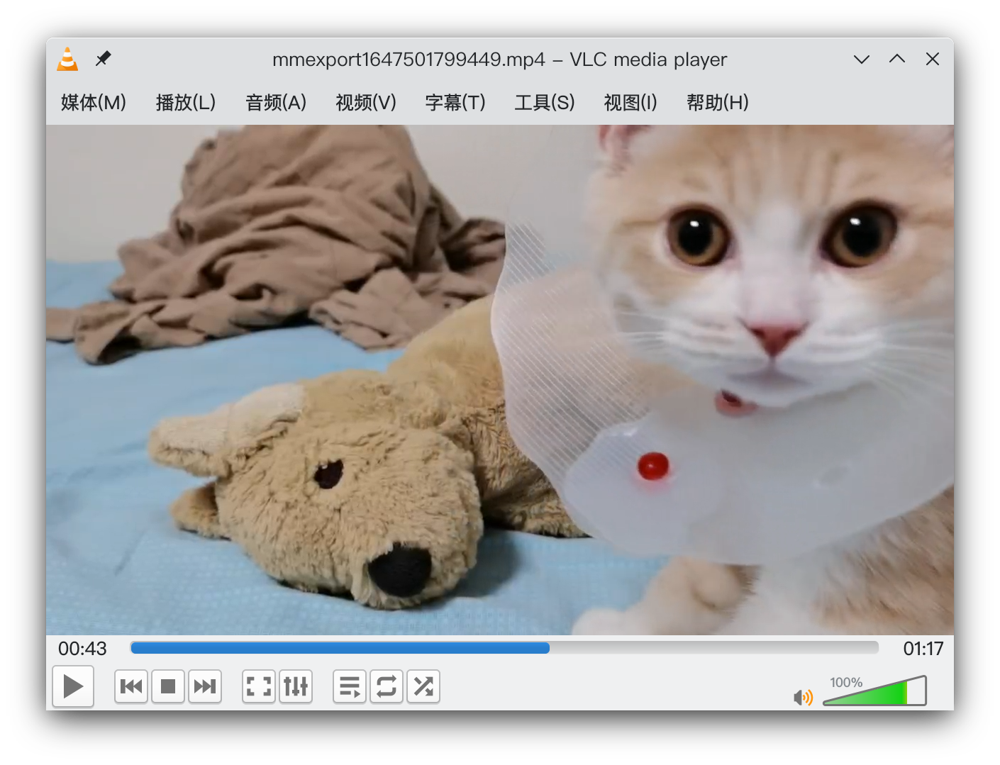
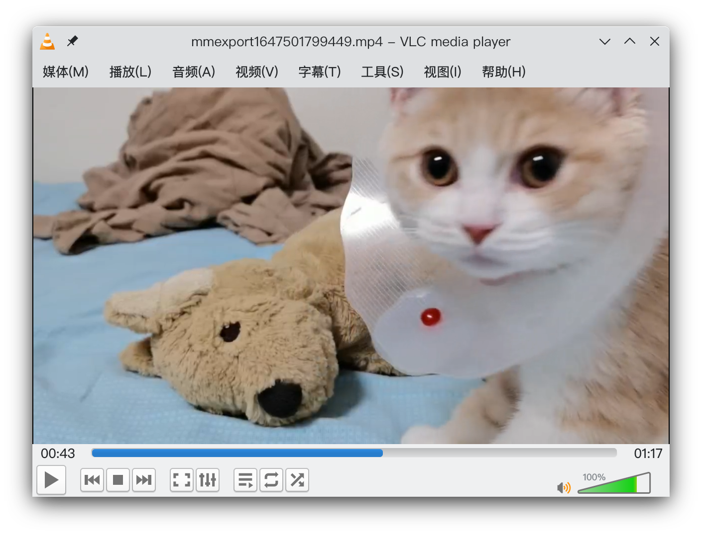

# （路过的蚂蚁都能听懂的）用 FFmpeg 做点视频剪辑

贵组经典新人任务：实现一个仿抖音的播放器(但缝合加料版)

[GalleryView](https://github.com/JunkFood02/Gallery-View)

> #### **进阶需求(难度较大)**
>
> 徐老板可能对视频不太满意
> - 所以要支持一些视频制作功能
>   -  裁剪视频长度
>   -  添加背景音乐
>   -  添加字幕
> -  制作完成的视频可以导出


## FFmpeg

FFmpeg 是一套 C 语言下开发的开源、跨平台的音视频录制、转码及流处理的完整解决方案。

> 别人造好的轮子有了，但如何在 Java / Kotlin 编写的 Android 程序中使用 C 语言编写的库？

答案：使用 NDK (Native Development Kit 原生开发套件)


## JVM 语言 与 Native 语言

提到 NDK，就不能不提大家更熟悉的 JDK (Java Development Kit) 以及 Java 语言。


Android 开发使用 Java / Kotlin 语言进行开发，而这两种语言最后都会被翻译成 `.class` Java 字节码，运行在 Java 虚拟机上(？)



戳啦，其实还要被翻译成 `.dex` Dalvik 字节码，然后再运行在 ART(Android Runtime) 上。(Dalvik 虚拟机已过时)



Java 作为一款跨平台、易移植的语言，最大的特点就是 Java 所编译得到的 Java 字节码并不直接运行在 *本地* 机器上 (Natively)，而是运行于 Java VM 上。Java 虚拟机屏蔽了不同硬件之间的差异，使得 Java 字节码可以在不同设备的 JVM 上实现“一次编译，随处运行”。

但 Java 由于其可移植性特化，必然在其他方面上做出了牺牲：

- 虚拟机运行时边解释 (编译) 边执行，比起像 C/C++ 这样直接运行在本地机器上的原生 (Native) 代码要慢上 10-20 倍。

- 由于虚拟机屏蔽了不同硬件之间的差异，Java 代码自然也无法深入到底层去进行一些操作系统层的操作。

  

为了提高 Android 系统运行的效率，Android 先后引入了 JIT 编译技术（Dalvik）与 AOT 编译技术（ART）：

- JIT (Just-In-Time) 即时编译：运行时内部设置计数器，当一段代码被反复执行很多遍时，将该段热点 (HotSpot) 代码编译为可本地运行的机器代码，避免多次编译。
- AOT (Ahead-Of-Time) 提前编译：在应用安装时即将所有字节码全部翻译为本地机器代码。

因此，对于现在的 Android 程序而言，JVM 语言其实已与 C/C++ 这样的原生语言的运行效率相差不大，除非需要用到一些 Java 所无法实现的需求，如进一步提升设备性能，以降低延迟或运行游戏或物理模拟等计算密集型应用，或者需要用到一些难以迁移到 Java 的 C/C++ 库等（FFmpeg）。


## NDK 与 JNI

我们先来看看 Android 系统的层级结构：


JNI 即 Java Native Interface，是 Java 提供用来与其他语言编写的程序通信的接口，之中定义了 Java 字节码与 Native 代码的交互方式。这里我们通过 NDK 来使用 JNI，从而实现 Android 程序中 Java 代码与 C/C++ 代码的相互调用。

NDK 即 Native Development Kit，其提供一个编译工具链以及其他开发工具，可以让我们在 Android 开发中使用和调试 C/C++ 语言编写而成的库。

在 Android 开发中，我们应当先在 Java (Kotlin) 文件中声明一个 `native` (`external`) 方法，然后在 C/C++ 文件中实现 Native 方法，接着使用 NDK 的工具链将 C/C++ 代码编译成 **动态链接库** ，然后使用 Android Studio 的 Gradle 将我们编译好的库打包到 APK 中。随后在运行程序时，Java 代码就可以通过 Java 原生接口 (JNI) 框架调用库中的 Native 方法。

Java 代码：

```java
private static native void run(String[] commands);
```

实现了 JNI 的 C 语言代码：

```c
Java_com_example_galleryview_model_FFmpegUtils_run(JNIEnv *env, jclass clazz,
                                                   jobjectArray commands) {
    int argc = (*env).GetArrayLength(commands);
    char *argv[argc + 2];
    int i;
    for (i = 0; i < argc; i++) {
        argv[i] = (char *) malloc(sizeof(char) * 100);
        auto js = (jstring) (*env).GetObjectArrayElement(commands, i);
        strcpy(argv[i], (char *) (*env).GetStringUTFChars(js, 0));
    }
    
    int resultCode = ffmpeg_exec(argc, argv);
    
    jmethodID finishCallback = (*env).GetStaticMethodID(clazz, "onProcessResult", "(Z)V");
    if (nullptr == finishCallback) {
        LOGE("can't find method");
        return;
    }
    (*env).CallStaticVoidMethod(clazz, finishCallback, resultCode);
    //调用Java代码内名为onProcessResult的静态函数，并将resultCode作为参数传入
}
```


## 交叉编译、构建系统与 CMake

交叉编译 (Cross Compile)，指在与目标机器不同处理器架构的编译机器上，编译出适合目标机器架构运行的程序，我们如果要在 x86_64 平台的 PC 中编译出运行于 arm 架构的 Android 设备中的 C/C++ 程序，就需要用到交叉编译工具链 (Toolchain)，即用于交叉编译的一系列工具。这里我们使用 NDK 提供的默认工具链（从 r19 版本之后开始，NDK 不再支持独立工具链）。


当我们编译一个 .c 文件的时候，我们可以直接将其丢进 gcc 中编译；但当我们需要编译一个项目的一系列 .c 文件或整合已有的库时，一股脑丢进去编译显然就会大乱套了，于是我们需要一个 **构建系统** 来管理这个项目的编译。

构建系统各自都有自己的构建文件来指导整个项目的编译，例如在 Windows 下有 Visual Studio 的 .sln 文件，macOS 下有 Xcode 的 .xcodeproj 文件，Unix 下可以使用 Make 的 Makefile 文件或 Ninja 的 .ninja 文件等等。


这些构建系统的构建文件可以指导编译器或编译工具链来编译整个项目。像 Makefile 或者 .ninja 这样的较为简单的构建系统文件，我们可以尝试手写一份进行构建，但当我们的构建以及编译要涉及跨平台交叉编译时，我们便要针对不同的目标平台编写不同的文件，因此目前更通用的做法是使用像 CMake 这样更高等级的构建系统来生成这些构建文件。


CMake 是 Cross platform Make 的简写。CMake 是一个开源的跨平台编译工具（又被称为「**元构建系统**」），其可以根据 CMakeLists.txt 配置文件来生成一个指导工具链进行编译的标准构建文件（不同平台下可选择生成不同构建系统的构建文件），随后工具链便可根据该构建文件将源代码编译成动态链接库。

Android Studio 推荐使用 CMake + Ninja + NDK 内置工具链来进行 Native 库开发。


## ABI

ABI 即应用二进制接口 (Application Binary Interface)。ABI 中包含以下信息

- 可使用的 CPU 指令集（和扩展指令集）。

- 运行时内存存储和加载的字节顺序。Android 始终是 little-endian（小端法）。

- 在应用和系统之间传递数据的规范（包括对齐限制），以及系统调用函数时如何使用堆栈和寄存器。

- 可执行二进制文件（例如程序和共享库）的格式，以及它们支持的内容类型。

- 如何重整 C++ 名称。

  

当我们编写 Java 代码时，由于无论是 Java 字节码，或是 Java 字节码翻译成的 Dalvik 字节码，其两者都与 Android 设备的 ABI 无关，我们无需关心设备具体的硬件条件、架构或 CPU。

但当我们需要在 Android 程序中使用 Native 代码时，由于不同的 Android 设备使用不同的 CPU，而不同的 CPU 支持不同的指令集，CPU 与指令集的每种组合都有专属的 ABI。因此我们需要针对不同的 Android ABI，构建并编译出**适应于不同 ABI** 的 .so 动态链接库。

当我们将这些为不同 ABI 所编译的库打包成 APK 时，这些 APK 自然也是只有特定 ABI 的 Android 设备才能安装使用的。例如：苹果芯片支持的 arm64-v8a 镜像无法安装专门为 armeabi-v7a 编译的 APK 包，我们在编译的时候可以在 Gradle 的 `ndk.abiFilters` 参数中控制要编译打包何种 ABI 的库。


## 总结

经过前述文字的梳理，想必已经对 Android 下使用 Native 库的的基本逻辑与行为有了一定的理解，我们再通过几张流程图来进行梳理：

1. 编写 CMakeLists.txt ，将 C/C++ 代码与引入的 FFmpeg 库加入到项目中，并链接到一起，稍后 Gradle 会根据这个文件来进行原生代码的构建
2. 在 Java 类中声明并调用 Native 方法
3. 在 C/C++ 代码中实现 Native 方法，Native 方法调用 FFmpeg 动态库中的函数
4. 使用 CMake + Ninja 与 NDK 工具链将我们自己编写的 C/C++ 代码编译成动态链接库，并将该库与引入的 FFmpeg 库链接到一起。
5. Gradle 将所有动态链接库一起打包进 APK 中










## 终于要开始给视频开刀了

虽然我们已经成功编译了 FFmpeg 的主要库并集成到了我们的 Android 应用中。我们暂时不需要知道这些库具体的作用和用法是什么，FFmpeg 已经为我们提供了方便的命令行工具来进行音视频操作，这个工具就在**源码**文件夹的 `fftools` 目录下，将其集成到 Android 应用中，我们便可方便快捷地使用 FFmpeg 来进行音视频操作。

我们来看看如何剪出一个视频的前 15 秒：

```
ffmpeg -ss 0 -i input.mp4 -t 15 -c copy output.mp4
```

**这不是有手就行？**

然后我们会发现剪出来的视频音画不同步，而且音频还比视频多出来几秒，这是怎么会是呢？


## 视频的重编码





（这两张图片大小各为 900k 左右）

如果视频忠实地按照每秒存储 24 张（甚至 30、60 张）图片来实现逐帧的播放，那么视频文件的大小将会十分恐怖。

视频文件通过记录关键帧，以及关键帧之间的变化来记录视频信息，这个过程叫视频的 **编码**。

而播放器通过读取关键帧，以及关键帧间信息来将视频还原成一张又一张的图片显示在屏幕上，这个过程则叫视频的 **解码**。

音画不同步的原因：视频流 seek 到关键帧上，而音频被完整剪辑

解决方法：使用视频解编码器进行重编码，即可实现精确裁剪（libx264、H264 编码）


## Native 层故障排除

主要是野指针和空指针

1. 最简单粗暴的方法：打 log


```c
__android_log_print(ANDROID_LOG_INFO,"FFmpeg","main:PROCESS START");
```

2. 看 logcat 里输出的报错信息


3. stack 查看 Tombstone 内储存的信息，分析栈帧（但是十分麻烦！）

> Tombstone 是一个包含与崩溃进程相关的额外数据的文件。具体而言，该文件包含崩溃进程中所有线程（而不只是捕捉到信号的线程）的堆栈轨迹、完整的内存映射，以及所有打开的文件描述符的列表。


## References

[在 Android 上利用 FFmpeg 给 Gif 图片加字幕](https://uniquestudio.feishu.cn/wiki/wikcnaZykdmOaQTR8F27iEENBcg)

[【联创の炼金工坊】Android NDK 之 Hello World](https://mp.weixin.qq.com/s/C23jWjwmgydqqBNdgMc-DQ)

[GCC/Make/CMake 之 GCC - 知乎](https://zhuanlan.zhihu.com/p/342151242)

[Android 集成 FFmpeg (一) 基础知识及简单调用_yhao的博客-CSDN博客](https://blog.csdn.net/yhaolpz/article/details/76408829)

[将 NDK 与其他构建系统配合使用  |  Android NDK  |  Android Developers](https://developer.android.google.cn/ndk/guides/other_build_systems?hl=zh-cn)

[Android ABI  |  Android NDK  |  Android Developers](https://developer.android.com/ndk/guides/abis)

[自动打包 CMake 使用的预构建依赖项  |  Android 开发者  |  Android Developers](https://developer.android.com/studio/releases/gradle-plugin#cmake-imported-targets)

[调试 Android 平台原生代码](https://source.android.com/devices/tech/debug)

视频，以及怎么基于FFmpeg播出来视频
