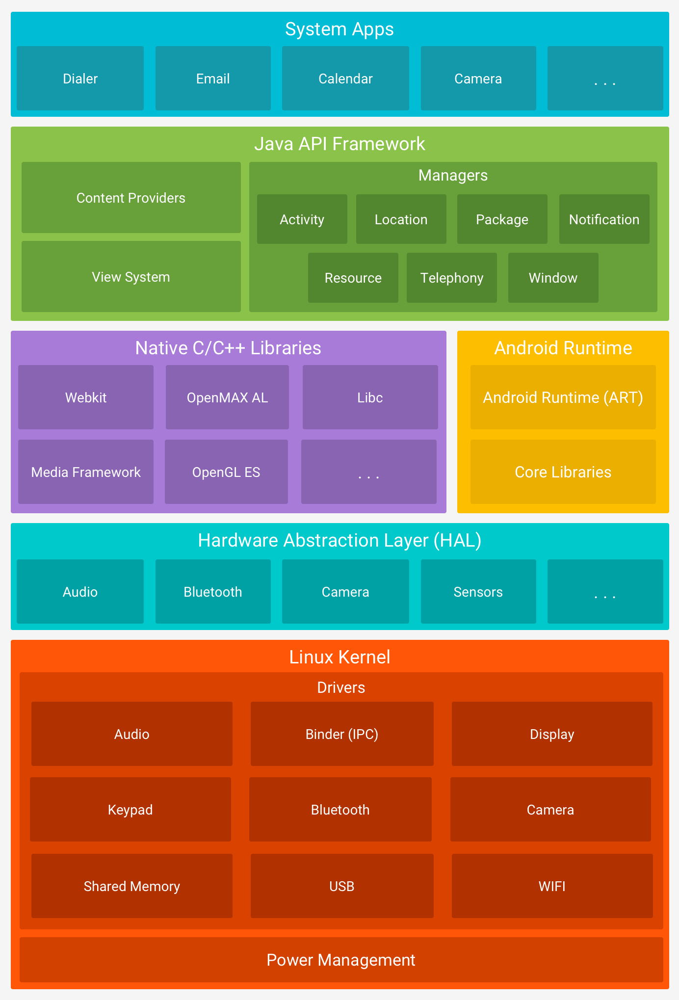

# 用 FFmpeg 做点视频剪辑

贵组经典新人任务：实现一个仿抖音的播放器（但缝合加料版）

> #### **进阶需求（难度较大）**
>
> - 徐老板可能对视频不太满意
>   - 所以要支持一些视频制作功能
>     -  裁剪视频长度
>     -  添加背景音乐
>     -  添加字幕
>   -  制作完成的视频可以导出

## FFmpeg

FFmpeg 是一套 C 语言下开发的开源、跨平台的音视频录制、转码及流处理的完整解决方案。

> 别人造好的轮子有了，但如何在 Java / Kotlin 编写的 Android 程序中使用 C 语言编写的库？

答案：使用 NDK （Native Development Kit 原生开发套件）

## Java 字节码与虚拟机

提到 NDK，就不能不提大家更熟悉的 JDK（Java Development Kit）以及 Java 语言。

Android 开发使用 Java / Kotlin 语言进行开发，而这两种语言最后都会被翻译成 `.class` Java 字节码，运行在 Java 虚拟机上（？）

戳啦，其实还要被翻译成 `.dex` Dalvik 字节码，然后再运行在 ART（Android Runtime）上。（Dalvik 虚拟机已过时）

Java 作为一款跨平台、易移植的语言，最大的特点就是 Java 所编译得到的 Java 字节码并不直接运行在 *本地* 机器上（Natively），而是运行于 Java VM 上。Java 虚拟机屏蔽了不同硬件之间的差异，使得 Java 字节码可以在不同设备的 JVM 上实现“一次编译，随处运行”。

但 Java 由于其可移植性特化，必然在其他方面上做出了牺牲：

- 虚拟机上的目标代码的运行速度，比起像 C / C++ 这样直接运行在本地机器上的 **原生**（Native）代码要慢上 10-20 倍。
- 由于虚拟机屏蔽了不同硬件之间的差异，Java 代码自然也无法深入到底层去进行一些操作系统层的操作。

为了提高 Android 系统运行的效率，Android 先后引入了 JIT（Just-In-Time）编译技术与 AOT (Ahead-Of-Time) 编译技术：

JIT

无论是这里的 Java 字节码或是 Dalvik 字节码，

## NDK，以及 Android 系统的 Native 层

我们有了 Android 开发常用的

我们先来看看 Android 系统的层级结构：

第一、二层：Java 开发，使用

虽然 Android 系统的许多 API 使用 Java 开发，但许多核心 Android 系统组件和服务（如 ART 和 HAL 等）由 C/C++ 写成，需要以 C/C++ 编写的 Native 库。因此 Android 除了提供开发 Java 代码所需的 JDK (Java Development Kit) 之外，还提供了供开发者进行 Native 层开发的 NDK (Native Development Kit)。

Java 运行于 Java 虚拟机之上，因而实现了易移植、可跨平台运行等特性，但这也使得 Android 需要依赖一些「Native」的代码来访问系统底层，去完成一些 Java 实现不了的任务。也正因如此，C/C++ 这类「原生」的语言也使 Android 程序丧失了跨平台这一特性，在为 Android 编译 C/C++ 程序时需考虑目标机器所使用的 CPU 架构、操作系统版本等。